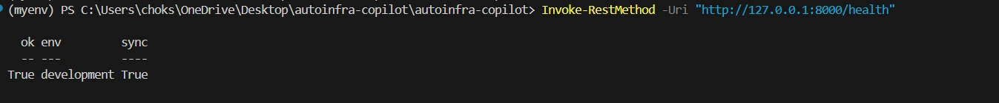
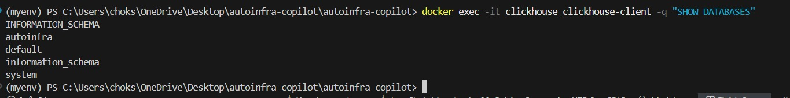
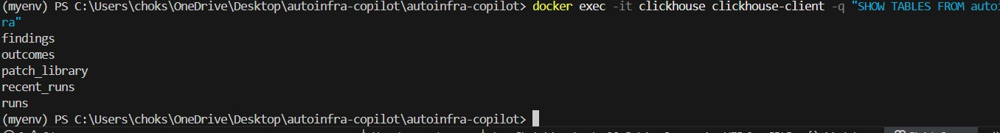
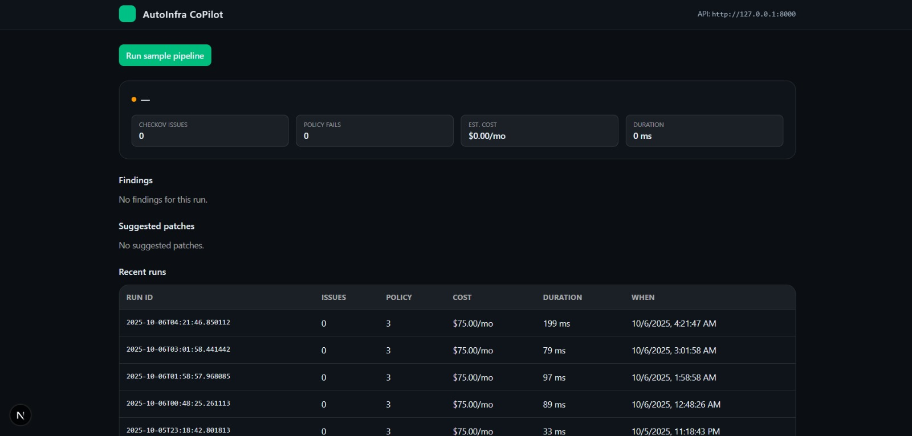
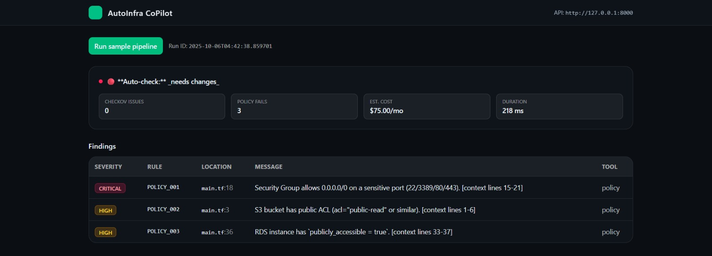
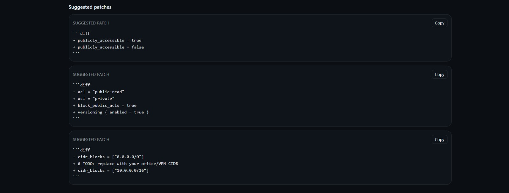
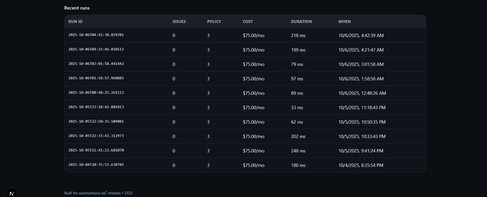

# AutoInfra-CoPilot

Secure Terraform PR reviews with autonomous checks, policy validation, and patch suggestions — all in one pipeline.

---

## 🚀 Elevator Pitch
**AutoInfra-CoPilot** is an AI-assisted platform that reviews Terraform infrastructure-as-code (IaC) pull requests.  
It automatically scans for misconfigurations, estimates costs, enforces policies, and suggests fixes — enabling teams to ship secure and cost-efficient infrastructure faster.

---

## 📖 Project Story

### Inspiration
Infrastructure pull requests are often delayed by long review cycles — cloud misconfigurations, cost regressions, and policy gaps are only caught late.  
We wanted to build a **copilot for DevOps teams** that brings AI + static analysis + infra cost checks together into one autonomous reviewer.

### What We Learned
- How to integrate **ClickHouse** for fast, queryable run histories.
- Setting up **Datadog** dashboards to monitor IaC review health.
- Designing a clean **Next.js frontend** for real-time run status.
- Orchestrating multiple tools (Checkov, OPA/Rego, Infracost, LLMs) into one seamless flow.

### How We Built It
1. **Backend (FastAPI)**: Orchestrates runs, stores results in ClickHouse, integrates Checkov & policy engines, sends metrics to Datadog.
2. **Ops Layer**: Docker Compose spins up ClickHouse and backend together. Init scripts create schemas and seed data.
3. **Datadog Integration**: Dashboards track number of runs, findings per run, pass/fail rates.
4. **Frontend (Next.js + Tailwind)**: Provides a developer-friendly UI to trigger runs, view findings, diffs, and history.
5. **GitHub Ready**: Can plug directly into PR workflows via webhook.

### Challenges
- Debugging Dockerized ClickHouse schemas with the backend.
- Handling “latest run” polling logic for frontend dashboards.
- Managing consistent state across memory storage and ClickHouse storage backends.
- Tight time constraints — balancing backend completeness with frontend scaffolding.

---

## 🛠 Built With
- **Languages**: Python, TypeScript
- **Frameworks**: FastAPI, Next.js, TailwindCSS
- **Cloud & Infra**: Docker, Docker Compose
- **Databases**: ClickHouse
- **IaC Analysis**: Checkov, OPA/Rego, Infracost
- **Monitoring**: Datadog
- **AI/LLM**: Prompt-driven composition for comments & patch suggestions

---

## ⚡ Quick Start

### Prerequisites
- Docker & Docker Compose
- Python 3.10+ (with `venv`)
- Node.js (for frontend)

### Backend
```bash
# from repo root
cd autoinfra-copilot
python -m venv myenv
source myenv/bin/activate   # or myenv\Scripts\activate on Windows
pip install -r requirements.txt

# start ClickHouse + backend
docker-compose up -d
uvicorn backend.main:app --reload --port 8000

### Verify
```bash
curl http://127.0.0.1:8000/health
```
### Run Example
```bash
curl -X POST http://127.0.0.1:8000/run \
  -H "Content-Type: application/json" \
  -d '{"repo":"demo/terraform","pr_number":1,"commit_sha":"deadbeef","tf_path":"backend/sample/tf"}'
```

### Frontend (Still in progress)
```bash
cd frontend
npm install
npm run dev
```

## Demo Screenshots

### 1. Backend Health


### 2. ClickHouse Data


### 3. ClickHouse tables


### 4. End-to-End


### 5 UI




